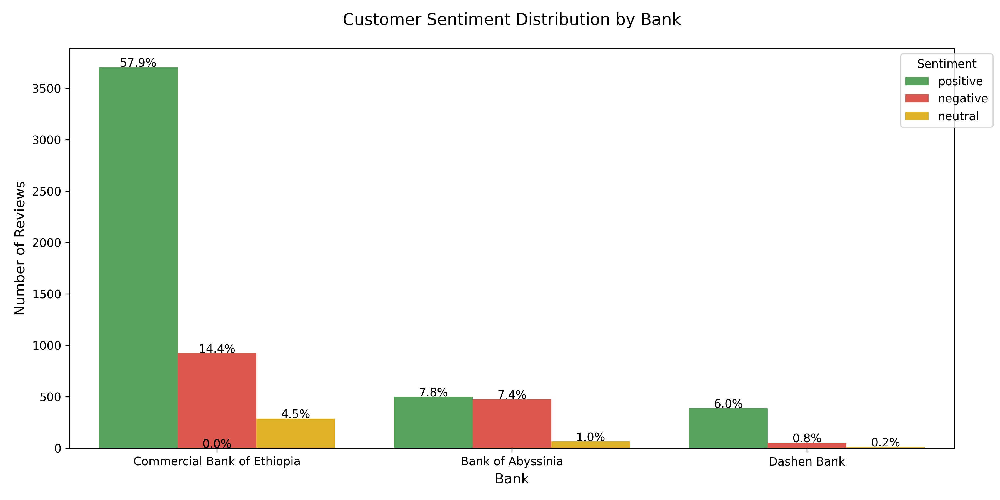
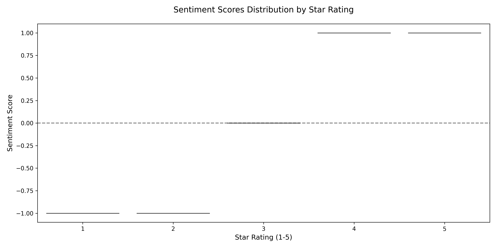

# Fintech App Reviews Analysis Report
Date: 2025-06-11

## Key Insights

### 1. Overall Sentiment Distribution

### 2. Bank Performance Comparison
| Bank | Avg. Sentiment | % Positive | Top Positive Keywords | Top Negative Keywords |
|------|----------------|------------|------------------------|------------------------|
| Commercial Bank of E | 0.566 | 75.4% |  |  |
| Bank of Abyssinia | 0.025 | 48.1% |  |  |
| Dashen Bank | 0.743 | 85.8% |  |  |

### 3. Detailed Analysis

## Recommendations
1. Improve Login Experience: Address 'login' issues mentioned in negative reviews
2. Enhance Performance: Optimize for keywords like 'slow' and 'lag'
3. Feature Development: Prioritize features mentioned in positive reviews
